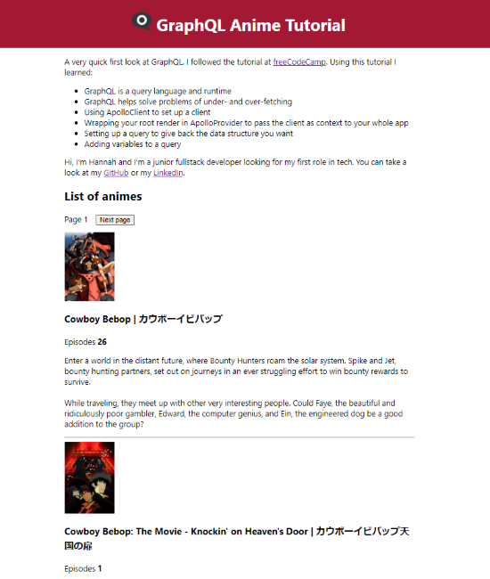

# GraphQL tutorial

A very quick first look at GraphQL. I followed the tutorial at
<a href="https://www.freecodecamp.org/news/graphql-for-front-end-developers/" target="_blank" rel="noopener noreferrer">freeCodeCamp</a>. Using this tutorial I learned:

-   GraphQL is a query language and runtime
-   GraphQL helps solve problems of under- and over-fetching
-   Using ApolloClient to set up a client
-   Wrapping your root render in ApolloProvider to pass the client as context to your whole app
-   Setting up a query to give back the data structure you want
-   Adding variables to a query

This project was bootstrapped with [Create React App](https://github.com/facebook/create-react-app).
